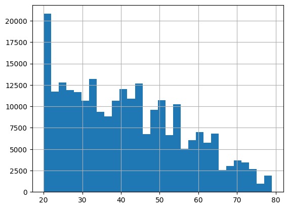
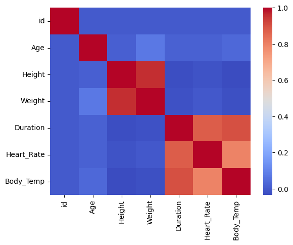
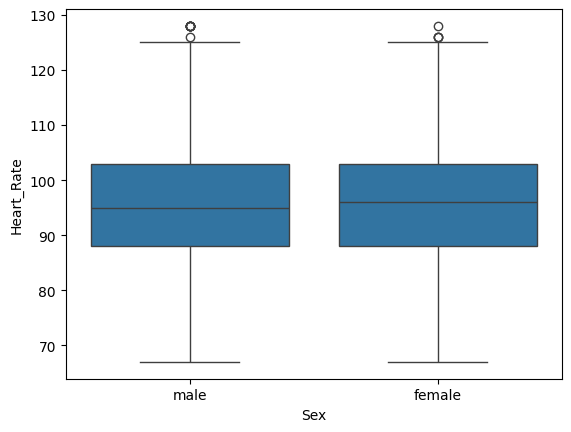

# Automating-EDA-for-Predicting-calorie-expenditure.
Predicting Calorie Expenditure 🥗🔥

📌 Project Overview

This project focuses on predicting calorie expenditure using health and fitness data. The goal is to analyze, visualize, and automate insights that help in understanding how factors such as age, weight, height, duration of activity, and heart rate affect calories burned.

The project also demonstrates the use of EDA automation tools like D-Tale to simplify exploration and gain quick insights into the dataset.

🚀 Features

Exploratory Data Analysis (EDA)

Summary statistics

Missing value imputation

Outlier detection

Correlation analysis

Visualization

Scatter plots 

Line charts (Growth trends)

Heatmaps (feature correlation)

EDA Automation

D-Tale integration for interactive dataset exploration

Sweetviz for automated reports

Feature Engineering

BMI calculation

Good Heart Rate classification

Predictive Modeling (optional extension)

Regression-based calorie predictions

🛠️ Tech Stack

Python 3.10+

Pandas, NumPy → Data handling

Matplotlib, Seaborn → Visualization

D-Tale, Sweetviz → EDA Automation

📂 Project Structure

📦 Predict-Calorie-Expenditure
├── data/                   # Dataset files
├── notebooks/              # Jupyter notebooks for EDA & modeling
├── reports/                # Automated reports (Sweetviz, D-Tale)
├── requirements.txt        # Dependencies
├── README.md               # Project documentation
└── main.py                 # Main script (if any)

⚡ Getting Started

1️⃣ Clone the Repository

git clone https://github.com/your-username/predict-calorie-expenditure.git
cd predict-calorie-expenditure

2️⃣ Create Virtual Environment

python -m venv venv
source venv/bin/activate   # On Mac/Linux
venv\Scripts\activate      # On Windows

3️⃣ Install Dependencies

pip install -r requirements.txt

4️⃣ Run D-Tale for Interactive EDA

import dtale
import pandas as pd

df = pd.read_csv("dataset.csv")
dtale.show(df).open_browser()

📊 Example Visualizations

Ages
**Image 1:** Pepole who are distributed age wise

Correlation
**Image 2:** Data's which are correlated

Heart Rate
**Image 3:**Male and females heart rate in boxplot

📈 Insights

Heart rate and duration strongly influence calorie expenditure.

BMI provides additional insights into calorie burn efficiency.

Automated tools like D-Tale and Sweetviz accelerate data understanding.

🤝 Contributing

Contributions are welcome! If you’d like to enhance this project, please fork the repo and submit a pull request.

⭐ If you find this project useful, don’t forget to star the repository!

